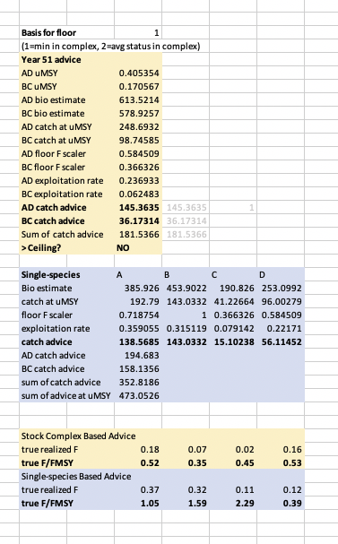

# Motivation

* lunch-time exercise  
* eFEP is long  
* boil down catch advice procedure  
* outline steps for a simple example 
 + one run-through of generating advice
* 'Stock-complex' idea for catch advice from eFEP
* comparison to single-species approach

.footnote[
###Slides at: [https://gavinfay.github.io/ebfm-pdt/excel-mp-example](https://gavinfay.github.io/ebfm-pdt/excel-mp-example)
]

---

## Develop thinking around stock complex catch advice

```{r, echo=FALSE, fig.retina = 4}
knitr::include_graphics("img/ebfm_mpfig_hart.png")
```

---

.pull-left[
# What this is

An example that works through steps based on proposed decision points  

To show how one could generate catch advice
]

--

.pull-right[
# What this is not

An evaluation of management procedure performance
]


---

# Decision points

1. Limit on total removals from system

2. Divide managed stocks into complexes 

3. Assess status of stock complexes?

3. Assess status of individual stocks?

4. Derive catch advice for complexes

4. Check status of individual stocks

5. Update complex catch advice based on constraints


---

# Operating Model

.pull-left[
4 stocks  

Independent population dynamics  
(Schaefer production model)  

Linked fishing mortality  
1 fishery, differing catchabilities  
]

.pull-right[
```{r, echo = FALSE, message = FALSE, fig.retina = 3, out.width="100%"}
library(tidyverse)
library(readxl)
library(patchwork)
tsdata <- read_xlsx("src/msmodel.xlsx", "Data-Generator", skip = 7) %>% 
  janitor::clean_names()
om <- tsdata %>% 
  select(1:6) %>% 
  pivot_longer(names_to = "species",
               values_to = "biomass",
               3:6) %>% 
  separate(species, remove = TRUE, into = c("a","species","b")) %>% 
  select(-c("a","b")) %>% 
  I()
p1 <- ggplot(om) +
  aes(x=t, y= f) +
  geom_line() +
  labs(x = "year",
       y = "fishing mortality",
       title = "Operating model Fishing Mortality") +
  theme_minimal() +
  NULL

p2 <- ggplot(om) +
  aes(x=t, y= biomass, group = species, color = species) +
  geom_line() +
  labs(x = "year",
       y = "biomass",
       title = "Operating model Biomass") +
  theme_minimal() +
  theme(legend.position = "top") +
  scale_color_viridis_d() +
  NULL

p1/p2


```
]


--

.footnote[
## Data generated:

Annual survey index by stock  
- summed to complex & system level  

Annual catches by stock
]

---

# Operating Model

.pull-left[
4 stocks  

Independent population dynamics  
(Schaefer production model)  

Linked fishing mortality  
1 fishery, differing catchabilities  
]

.pull-right[
```{r, echo = FALSE, warning = FALSE, message = FALSE, fig.retina = 5, out.width="100%"}
index <- tsdata %>% 
  select(c(1,7:10,19,22,25)) %>% 
  pivot_longer(names_to = "species",
               values_to = "index",
               -1) %>% 
  mutate(species = case_when(species == "total_bio_19" ~ "x_system_x",
            species == "total_bio_22" ~ "x_ad complex_x",
            species == "total_bio_25" ~ "x_bc complex_x",
            TRUE ~ species)) %>% 
  separate(species, remove = TRUE, into = c("a","species","b")) %>% 
  select(-c("a","b")) %>% 
  mutate(species = as.factor(species),
         species = fct_relevel(species, c("a","b","c","d",
                         "ad", "bc","system"))) %>% 
  I()
#index
index %>% 
  ggplot() +
  aes(x = t, y = index, color = species, group = species) +
  geom_point(alpha = 0.8) +
  facet_wrap(~species, scales= "free", ncol =2) +
  labs(x = "year",
       y = "index",
       title = "Survey Index Observations") +
  theme_minimal() +
  theme(legend.position = "none") +
  scale_color_viridis_d() +
  NULL


```
]

.footnote[
## Data generated:

Annual survey index by stock  
- summed to complex & system level  

Annual catches by stock
]

---

# Assessment Models

Regression-based production models

Fit to survey & catch time series

Separate models for:  
* each stock  
* each complex  
* system

--

These assessment models calculate
* $\frac{B_{last}}{B_{MSY}}$
* $F_{MSY}$
* $MSY$
* $OFL_{next} = B_{last} * F_{MSY}$ 

--


We get estimates for these at the stock, complex, & system levels.

---

# Management Procedure
### single-species version

* <p style="color:grey">Set system removal limit at system MSY estimate</p>
* <p style="color:grey">Assess status of stock complexes</p>
* <p style="color:grey">Set `F_{use}` to `F_{MSY}` for each complex</p>
* __<p>Assess status of individual stocks__</p>
* __<p>Apply $F_{MSY}$ to `B` estimates for stocks, calcultate OFL__</p>
* <p style="color:grey">Compare stock survey index to max observed for each stock. Less than 0.25?</p>
* <p style="color:grey">Floor based on avg or min status in complex?</p>
* <p style="color:grey">If floor < 0.25 max, reduce `F_{use}` for complex</p>
* <p style="color:grey">Apply `F_{use}` to `B` estimates for complexes, calcultate OFL</p>
* <p style="color:grey">If sum of OFL over complexes exceeds system limit, reduce complex OFLs accordingly.</p>

---

# Management Procedure
### stock complex version

* __<p>Set system removal limit at system MSY estimate__</p>
* __<p>Assess status of stock complexes__</p>
* __<p>Set $F_{use}$ to $F_{MSY}$ for each complex__</p>
* <p style="color:grey">Assess status of individual stocks</p>
* <p style="color:grey">Apply `F_{MSY}` to `B` estimates for stocks, calcultate OFL</p>
* __<p>Compare stock survey index to max observed for each stock. Less than 0.25?__</p>
* __<p>Floor based on avg or min status in complex?__</p>
* __<p>If floor < 0.25 max, reduce $F_{use}$ for complex__</p>
* __<p>Apply $F_{use}$ to `B` estimates for complexes, calcultate OFL__</p>
* __<p>If sum of OFL over complexes exceeds system limit, reduce complex OFLs accordingly.__</p>

---

# switch to Excel

[open msmodel.xlsx](src/msmodel.xlsx)


---

```{r echo=FALSE, out.height="50%", fig.retina=3}

```

---

# Is this useful?

--

## What elements are helpful?

--

## What elements are not helpful?

--

## Additional decision points / features?

* better representation of technical interactions
* modeled stocks given names/characteristics

--

## Stick with Excel or use Shiny?

* user-driven choice over which/what decisions


###Slides at: [https://gavinfay.github.io/ebfm-pdt/excel-mp-example](https://gavinfay.github.io/ebfm-pdt/excel-mp-example)

